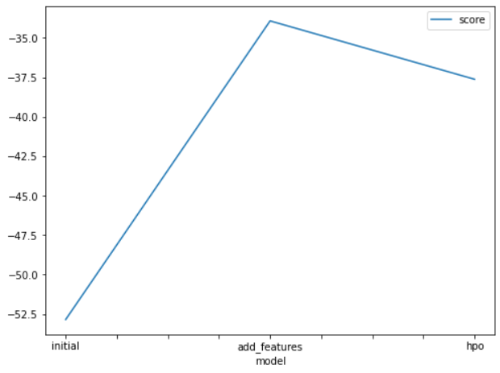

# Report: Predict Bike Sharing Demand with AutoGluon Solution
#### Kunal Garg

## Initial Training
### What did you realize when you tried to submit your predictions? What changes were needed to the output of the predictor to submit your results?
Three models were trained in total.
1. Initial Submission   **[Model: `initial`]**
2. Added Features Submission **[Model: `add_features`]**
3. Hyperparameter Optimization (HPO) - Initial Setting Submission
With some models, the prediction would come out to be negative which needed correction.

### What was the top ranked model that performed?
`add_features Model` was my `top model` submission which scored **0.44798 (on test dataset)** on **Kaggle**. This model was developed using EDA and feature engineering, without hyperparameter optimization. This model performed the best on the unseen test dataset.Selection was based on performance in Kaggle (test data) scores.

## Exploratory data analysis and feature creation
### What did the exploratory analysis find and how did you add additional features?
The `season` and `weather` features were initially interpreted as integers but were later converted into categorical variables. The independent features `year`, `month`, `day`, and `hour` were extracted from the original `datetime` feature using feature extraction, and the `datetime` feature itself was subsequently removed. The features `casual` and `registered` were present only in the train dataset and were disregarded during model training as they were absent in the test data. Additionally, `temp` and `atemp` were dropped due to their high correlation with other variables.

### How much better did your model preform after adding additional features and why do you think that is?
Additional features improved model performance by approximately 75% compared to the initial model. Ignoring `casual` and `registered` features during training and dropping the highly correlated `atemp` variable reduced multicollinearity. Converting categorical variables from integer to true categorical data types boosted model performance. Splitting the `datetime` feature into `year`, `month`, `day`, `hour` enhanced the model's ability to capture seasonality and historical patterns.

## Hyper parameter tuning
### How much better did your model preform after trying different hyper parameters?
Hyperparameter tuning was beneficial because it enhanced the model's performance compared to the initial submission but the model still underperformed compared to the `Added Features Model` which turned out to be my top model.

### If you were given more time with this dataset, where do you think you would spend more time?
If I were given more time, I think I would like to further understand the given data and analyse it more thoroughly. I would also try running AutoGluon for longer time periods to understand different outcomes with changed hyperparameters

### Create a table with the models you ran, the hyperparameters modified, and the kaggle score.
|model|hpo1|hpo2|hpo3|score|
|--|--|--|--|--|
|initial|prescribed_values|prescribed_values|"presets: 'high quality' (auto_stack=True)"|1.79358|
|add_features|prescribed_values|prescribed_values|"presets: 'high quality' (auto_stack=True)"|0.44434|
|hpo|Tree-Based Models: (GBM, XT, XGB & RF)|KNN|"presets: 'optimize_for_deployment"|0.55036|

### Create a line plot showing the top model score for the three (or more) training runs during the project.

### Create a line plot showing the top kaggle score for the three (or more) prediction submissions during the project.

## Summary
In this project, AutoGluon was utilized to predict bike sharing demand. The initial model submission achieved a score of 1.79358, which was improved to 0.44434 by adding additional features and performing exploratory data analysis. Hyperparameter tuning further improved the model's performance, although it still fell short compared to the top-performing model with added features. EDA is a very crucial step in machine learning. Understanding data helps in making better informed decisions and bring out the max from the model.
